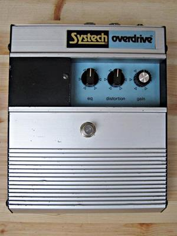

# ggoverdrive

Just for fun, I have been trying to simulate the Systech Overdrive pedal from the 70's.

This is an quite rare and odd overdrive with a variable wah-like bandpass filter before an 
opamp overdrive stage with diode clipping.

The plugin is ok now, but not as the real analog pedal.

The plugin uses the JUCE framework https://docs.juce.com/master/index.html. I have only
tested the plugin with the Reaper DAW on Windows.

The signal chain in the Systech Overdrive consists of (in this order)
* A JFET buffer
* A variable inverting multiple feedback bandpass filter (the "eq" control)
* A "distortion" control (voltage divider to limit signal to the next stage)
* A high pass filter that cuts some bass before the distortion stage
* An opamp gain stage (gain approx 400)
* Diode clipping stage with two 1N4148 diodes in opposite direction connected to ground
* A volume control (the "gain" control, a voltage divider to limit signal to the next stage)
* A BJT transistor gain stage (gain approx. 2)

In the plugin the signal chain looks something like this:

* A variable gain stage (to adjust the incoming signal level)
* Variable band pass filter
* First order high pass filter (to cut some bass before the distortion stage at 300 Hz)
* A variable gain stage (to raise the signal to introduce clipping in the next stage)
* A waveshaper stage to clip the signal (simulating opamp clipping)
* Static gain stage to adjust the signal before the next clipping stage)
* A waveshaper stage to clip the signal (simulating diode clipping)
* A variable gain stage as output level control
* Finally one more waveshaper stage to limit the signal and avoid unwanted clipping in the rest of the DAW signal chain.
